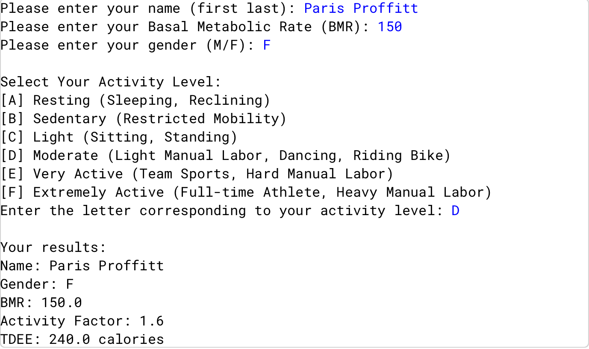

# Total Daily Energy Expenditure (TDEE) Calculator

## Description
This project is part of my AP Computer Science A coursework.  
It is a Java program that calculates a user's Total Daily Energy Expenditure (TDEE) based on their weight, height, age, sex, and activity level. The program outputs the calculated TDEE and displays it in an easy-to-read format.

## Features
- Prompts the user to enter their personal information: weight, height, age, gender, and activity level.
- Converts measurements to the proper units for calculation.
- Uses formulas to calculate TDEE accurately.
- Displays the user's TDEE clearly for daily caloric needs.

## Skills Demonstrated 
- Collecting and parsing user input in Java.
- Performing arithmetic calculations and unit conversions.
- Implementing conditional statements to handle activity level differences.
- Formatting output for clear and readable results.

## How to Run
1. Open the project in **BlueJ**.
2. Compile all classes.
3. Run the main class (`TDEE`).
4. Enter your personal information when prompted.
5. The program will calculate and display your Total Daily Energy Expenditure.

## Sample Output
Here’s a preview of the TDEE program in action:

## Notes
- This project was completed using **BlueJ**.
- All source code is written in **Java**.
